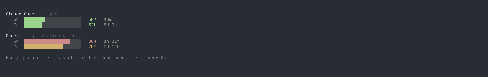

# ghostty-agent-usage-dashboard

A quota panel for Claude Code and Codex, summoned in Ghostty by a global hotkey
and dismissed with Esc or a click anywhere outside. It does not take a menu bar
slot, does not touch your tab names, and does not compete with anything for the
window title.



## How it gets the numbers

Neither agent offers a way to ask for its quota. Both numbers are snapshots
left behind while the agent was running, and they reach this tool differently:

| Agent | Where the number comes from | Setup |
|---|---|---|
| **Claude Code** | The 5h/7d windows appear only in the JSON its status line command receives on stdin (`rate_limits.five_hour` / `seven_day`). Nothing is written to disk. | Required — `statusline-tap` has to sit in that slot. Coralline users can instead set `VL_LIMIT_SYNC=1` and this reads its high-water store. |
| **Codex** | It records `payload.rate_limits` in its own session rollouts under `~/.codex/sessions/`. Each window carries its own `window_minutes`, which is what names it here — the shorter window is shown first. Only the general `codex` quota is read. | None. It already writes them. |

Nothing here calls a network API. The only file read outside the two agents'
own data is `~/.claude/settings.json`, for its `model` key alone. While the panel is open
it re-reads local files every 5 seconds. Closing it stops the panel; an installed
`statusline-tap` still runs whenever Claude Code refreshes its status line,
including timer refreshes.

The tap merges each window by latest reset time, then highest percentage. An
unchanged or lower reading keeps `taken_at`, the latest high-water change.
Every tap write advances `observed_at`; tap staleness and the panel's age use
that observation time. The detail output also shows the last change time.

Because the readings are snapshots, the panel says how old they are:

- older than 30 minutes → marked with its age: `last observed` for the tap,
  `last change` for Coralline, or `snapshot from` for Codex
- older than its own reset time → that window shows `–` rather than a
  percentage that describes a window which has since reset
- absent from the source → shown as `not reported`; Claude Code also drops
  windows after they reset, so an absent Claude window does not prove it was
  never reported

Coralline ages are labelled `last change`: unchanged usage does not update its
store, so its age cannot show whether Claude Code is running.

A stale source is annotated in place, under the windows it applies to:

```
  Claude Code  ·  opus
     5h  █████████░░░░░░░░░░░░░   43%   48m
     7d  █████░░░░░░░░░░░░░░░░░   22%   5d 9h

  Codex  ·  gpt-6-astra (high)
     5h  █████████░░░░░░░░░░░░░   39%   2h 43m
     7d  ███████████░░░░░░░░░░░   52%   3d 21h
     ↑ snapshot from 73m ago

  Esc / q close   ·   s shell (exit returns here)   ·   every 5s
```

The display side is Ghostty's **quick terminal**: it is the only surface with
`GHOSTTY_QUICK_TERMINAL=1` set, so the shell hook there hands over to the panel
and every other shell is untouched. The panel is an ordinary terminal program —
no daemon, no polling of any service, and nothing that another program can
overwrite.

## Requirements

- macOS and Ghostty 1.3+ — verified. This tool targets macOS; Linux is
  untested and needs more than the hotkey: Ghostty's quick terminal requires
  Wayland's layer-shell protocol and is not supported on GNOME, and the global
  hotkey additionally needs a desktop environment implementing the
  GlobalShortcuts portal (KDE 5.27+; not wlroots compositors such as Sway).
- zsh, bash or fish
- Python 3.9+ — macOS's `/usr/bin/python3` is enough, but it needs the Xcode
  Command Line Tools (`xcode-select --install`)

## Install

Clone this repository anywhere you like, then:

```bash
./install.sh
```

The installer adds a marked block at the top of your shell rc, preserving its
symlink and permissions. It asks zsh for `ZDOTDIR`, including values set without
`export` in `.zshenv`. If the panel has moved or is no longer executable, the
hook lets the shell continue.

If a standard Ghostty config already contains the installer's marked block,
the installer reports that it already has the hook. Otherwise, if any standard
Ghostty config contains a `keybind` or `config-file` directive,
the installer leaves Ghostty settings untouched and prints two settings for
you to review and paste. It checks both `config` and `config.ghostty` in the
platform config directory and the XDG config directory, but does not follow
includes. Otherwise it adds the hotkey and adds a position only if none is set.
Re-running adds nothing. `AGENT_USAGE_HOTKEY` accepts a single chord such as
`cmd+shift+u` for the first install; it is lowercased, and malformed chords are
rejected before edits. A found Ghostty
binary is checked for version 1.3+ and validates the key name using an isolated
config. Without a binary, only chord syntax can be checked, and the installer
reports that version and key names are unchecked. If automatic reload fails, open a Ghostty window and press
`cmd+shift+,`. Changing `quick-terminal-position` later needs a full Ghostty
restart, not a config reload.

Then point Claude Code's status line at the tap, in `~/.claude/settings.json`:

```jsonc
// no status line of your own yet
{ "statusLine": { "type": "command", "command": "~/path/to/statusline-tap" } }

// you already have one — its output is unchanged, it is only wrapped
{ "statusLine": { "type": "command", "command": "~/path/to/statusline-tap my-statusline --flag" } }
```

The wrapped command is run as a program with arguments, not through a shell, so
wrap a shell command string yourself: `statusline-tap sh -c 'your | pipeline'`.

On macOS the global hotkey needs permission:
**System Settings → Privacy & Security → Accessibility → enable Ghostty.**
Ghostty requests it when a `global:` binding is loaded; without it the binding
does not take effect.

## Use

| Key | |
|---|---|
| `cmd+shift+u` | summon or dismiss (global) |
| click outside | hides automatically, where `quick-terminal-autohide` is on — the default on macOS, but not on Linux |
| `Esc` / `q` / `Ctrl-D` | close |
| `s` | drop to a shell in place; `exit` returns to the panel |

The reader works on its own in any terminal, including ones that only embed
libghostty (such as cmux) where the quick terminal does not exist:

```bash
./agent-usage --format detail   # for reading
./agent-usage --format line     # one line for a status bar of your own;
                                # a trailing ? marks a stale reading
./agent-usage --format json     # for feeding something else
./agent-usage --stale-after 600 # treat readings older than 10 minutes as stale
```

`--stale-after` applies to that one command; the panel uses its own
`STALE_AFTER` constant at the top of `quick-view`.

## Updating

The panel is a long-running process: the quick terminal keeps the one it
started with until that surface closes. After pulling a new version, press `q`
in the panel and summon it again, or the old panel keeps running against the
new reader. It will say `reader output not understood` rather than show wrong
numbers if the two disagree.

## Configuration

| To change | Edit |
|---|---|
| the hotkey | the `keybind` line the installer added to your Ghostty config |
| where the panel appears | `quick-terminal-position`: `center`, `top`, `bottom`, `left`, `right` |
| layout, colours, refresh interval, staleness | the constants at the top of `quick-view` |
| where the cache lives | `AGENT_USAGE_STATE_DIR` (default `~/.config/agent-usage`) |

The hook runs before the rest of your shell rc for a fast summon. Set
`AGENT_USAGE_STATE_DIR` in `.zshenv` (with `export`) or in Ghostty's `env =`
configuration, not later in `.zshrc`. Both the panel and the Claude Code process
running the tap must receive the same value. A leading `~` is expanded.

## Known limitations

- API-key Claude Code sessions do not report rate limits. An installed tap
  records that fact; when no windows are cached, the panel distinguishes it
  from a missing tap cache. Cached windows remain visible across sessions, so
  moving an existing install from a subscription to an API key leaves them on
  display until they expire and then reads them as reset rather than as
  unreported — delete the cache to clear it.
- Coralline shows the last usage change, not session liveness. Tap ages likewise
  do not prove whether a session is active: any tap write refreshes the shared
  observation time, including timer refreshes and payloads without rate limits.
- Within a window, the tap's high-water percentage never decreases. This keeps
  an idle session from republishing an old lower number, but can overstate usage
  after a plan change or account switch.
- `rate_limits.spend_limit` is ignored.
- Codex reports separate quota buckets, including model-specific ones. Only the
  general `codex` bucket is read; the others are skipped, and if no general
  snapshot is found the panel names the buckets it did see rather than showing
  an unrelated percentage.
- Linux is untested and is expected to stay that way — this tool targets
  macOS. Nothing here is deliberately macOS-only, so a Linux user who wants to
  take it on is welcome to.
- `CODEX_HOME` and `CLAUDE_CONFIG_DIR` are not supported; agent data is read
  from `~/.codex` and `~/.claude`.
- The reader selects whole snapshots, not the newest event independently for
  each window. Codex scans the eight most recently modified rollouts.
- JSON `resets_at` values may be integers or floats depending on the source.
- Ghostty `config-file` includes are not followed; bindings with includes need
  manual review.

## Uninstall

1. Delete the `# >>> agent-usage >>>` block from your shell rc file
2. Delete the `# >>> agent-usage >>>` block from your Ghostty config
3. Restore the previous `statusLine` command in `~/.claude/settings.json`
4. `rm -rf ~/.config/agent-usage` — or wherever `AGENT_USAGE_STATE_DIR`
   pointed — and this checkout

## Contributing

`DESIGN.md` covers why the tool is shaped this way — the display locations that
were measured and rejected, what the two data sources allow, and the traps that
produced the current shape. `CLAUDE.md` carries the constraints and the checks
to run after a change.

## License

MIT — see [LICENSE](LICENSE).
